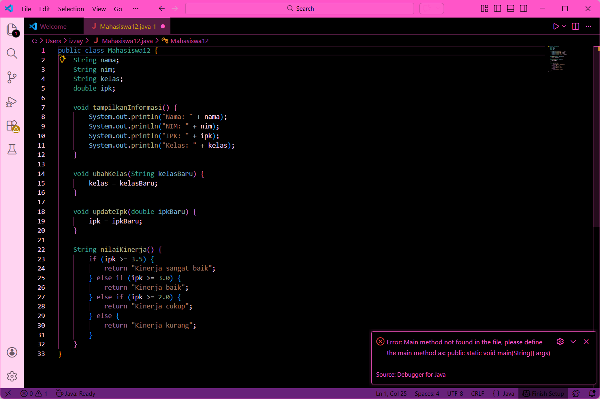
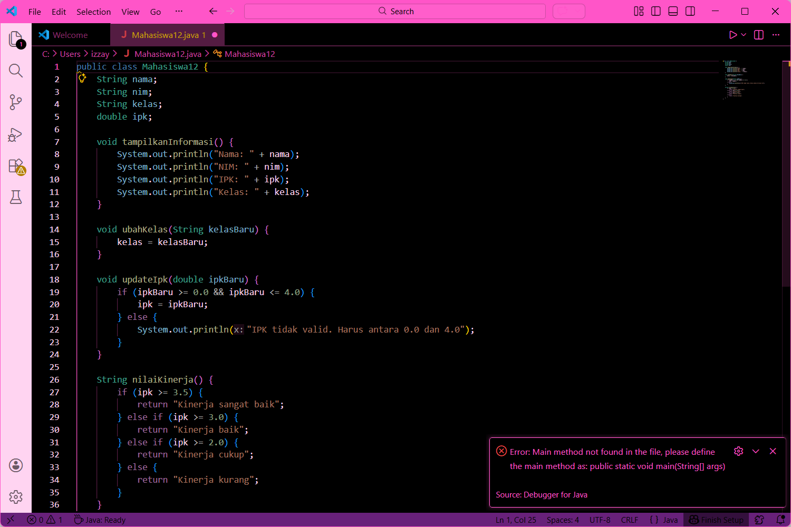
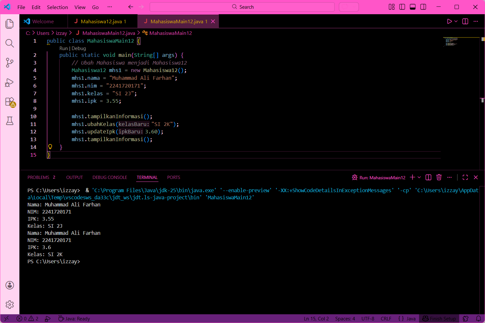
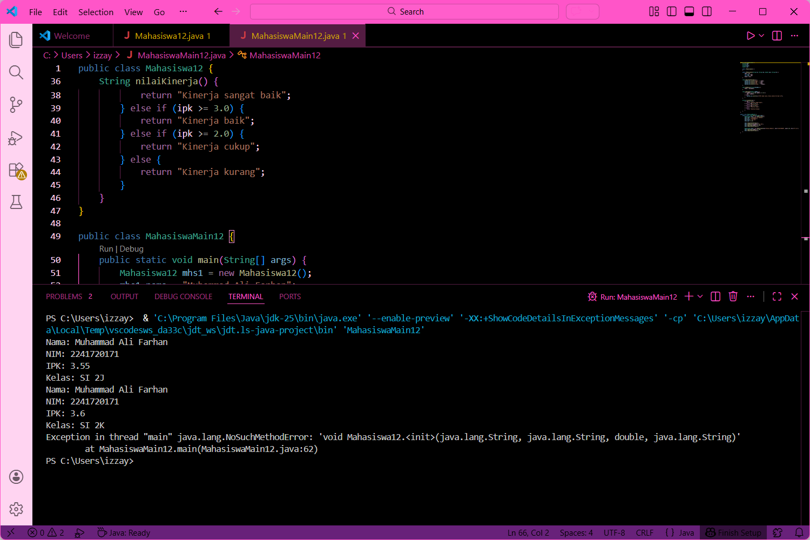
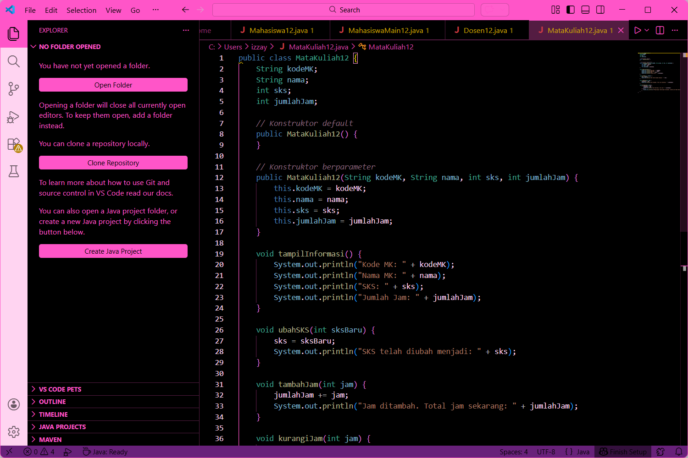
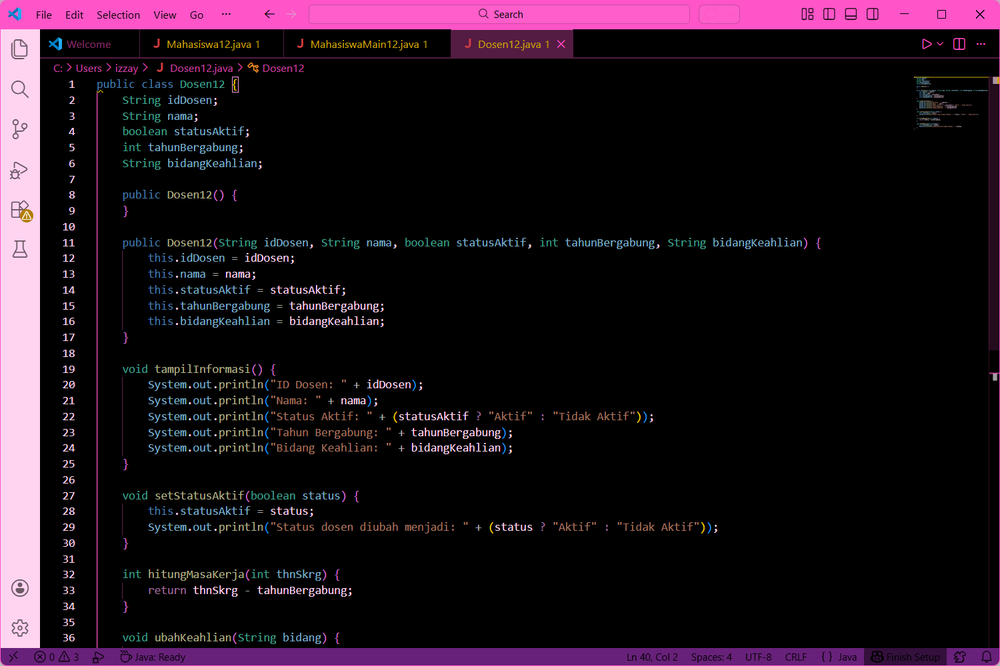

# Laporan Praktikum Algoritma dan Struktur Data - Jobsheet 2: Object

<h4>Nama : Izza Yaasmin Nabilla<h4>
<h4>NIM : 254107020226<h4>
<h4>Kelas : TI-1H<h4>

## 2.1 Percobaan 1: Deklarasi Class, Atribut dan Method



### Deskripsi Kegiatan:
Pada percobaan ini, dilakukan pembuatan class `Mahasiswa` beserta atribut dan method yang dimilikinya sesuai dengan Class Diagram. Atribut yang dibuat meliputi `nim`, `nama`, `kelas`, dan `ipk`. Sedangkan method yang dibuat adalah `tampilkanInformasi()`, `ubahKelas()`, `updateIpk()`, dan `nilaiKinerja()`.

### Jawaban Pertanyaan 2.1.3:
1. **Sebutkan dua karakteristik class atau object!**
   * **Class**: Merupakan blueprint atau rancangan yang mendefinisikan atribut (data) dan method (perilaku).
   * **Object**: Merupakan instansi atau wujud nyata dari sebuah class yang memiliki identitas dan nilai data tersendiri.

2. **Ada berapa atribut yang dimiliki oleh class Mahasiswa? Sebutkan apa saja atributnya!**
   * Terdapat 4 atribut, yaitu: `nim` (String), `nama` (String), `kelas` (String), dan `ipk` (double).

3. **Ada berapa method yang dimiliki oleh class tersebut? Sebutkan apa saja methodnya!**
   * Terdapat 4 method, yaitu: `tampilkanInformasi()`, `ubahKelas()`, `updateIpk()`, dan `nilaiKinerja()`.

4. **Modifikasi isi method `updateIpk()` sehingga IPK yang dimasukkan valid (0.0 sampai dengan 4.0):**
   ```java
   void updateIpk(double ipkBaru) {
       if (ipkBaru >= 0.0 && ipkBaru <= 4.0) {
           ipk = ipkBaru;
       } else {
           System.out.println("IPK tidak valid. Harus antara 0.0 dan 4.0");
       }
   }



### Jawaban Pertanyaan 2.1.3:
4. **Modifikasi isi method `updateIpk()` sehingga IPK yang dimasukkan valid (0.0 sampai dengan 4.0):**
   ```java
   void updateIpk(double ipkBaru) {
       if (ipkBaru >= 0.0 && ipkBaru <= 4.0) {
           ipk = ipkBaru;
       } else {
           System.out.println("IPK tidak valid. Harus antara 0.0 dan 4.0");
       }
   }


## 2.2 Percobaan 2: Instansiasi Object, Atribut dan Method



### Deskripsi Kegiatan:
Pada praktikum ini, dilakukan proses instansiasi atau pembuatan objek nyata dari class `Mahasiswa12` di dalam class `MahasiswaMain12`. Objek tersebut kemudian diisi datanya dan dimanipulasi menggunakan method-method yang telah didefinisikan sebelumnya untuk melihat perubahan state pada objek.

### Jawaban Pertanyaan 2.2.3:
1. **Pada class MahasiswaMain12, tunjukkan baris kode program yang digunakan untuk proses instansiasi! Apa nama object yang dihasilkan?**
   * Baris kode instansiasi: `Mahasiswa12 mhs1 = new Mahasiswa12();`.
   * Nama objek yang dihasilkan adalah `mhs1`.

2. **Bagaimana cara mengakses atribut dan method dari suatu objek?**
   * Atribut dan method diakses dengan menggunakan operator titik (`.`) setelah nama objek. Contoh: `mhs1.nama = "..."` atau `mhs1.tampilkanInformasi()`.

3. **Mengapa hasil output pemanggilan method `tampilkanInformasi()` pertama dan kedua berbeda?**
   * Hasilnya berbeda karena di antara pemanggilan tersebut terdapat eksekusi method `mhs1.ubahKelas("SI 2K")` dan `mhs1.updateIpk(3.60)`. Method-method ini mengubah nilai yang tersimpan di dalam atribut objek `mhs1`, sehingga saat ditampilkan kembali, datanya sudah diperbarui.


## 2.3 Percobaan 3: Membuat Konstruktor



### Deskripsi Kegiatan:
Pada percobaan ini, dilakukan implementasi konstruktor pada class `Mahasiswa12`. Konstruktor merupakan method khusus yang dipanggil secara otomatis saat objek dibuat untuk menginisialisasi atribut. Praktikum ini mencakup pembuatan konstruktor default dan konstruktor berparameter untuk mempermudah pengisian data awal objek.

### Jawaban Pertanyaan 2.3.3:
1. **Tunjukkan baris kode program yang digunakan untuk mendeklarasikan konstruktor berparameter!**
   ```java
   public Mahasiswa12 (String nm, String nim, double ipk, String kls) {
       nama = nm;
       this.nim = nim;
       this.ipk = ipk;
       kelas = kls;
   }

2. **Apa sebenarnya yang dilakukan pada baris program `Mahasiswa12 mhs2 = new Mahasiswa12("Annisa Nabila", "2141720160", 3.25, "TI 2L");`?**
   * Baris tersebut melakukan **instansiasi** atau pembuatan objek baru bernama `mhs2`.
   * Secara bersamaan, baris ini memanggil **konstruktor berparameter** untuk mengisi nilai atribut `nama`, `nim`, `ipk`, dan `kelas` secara langsung saat objek diciptakan.

3. **Hapus konstruktor default pada class Mahasiswa12, kemudian compile dan run program. Bagaimana hasilnya? Jelaskan!**
   * Hasilnya akan terjadi **error kompilasi** (compile error).
   * Hal ini terjadi karena pada class `MahasiswaMain12`, objek `mhs1` masih diinstansiasi menggunakan konstruktor default (`new Mahasiswa12()`).
   * Java hanya menyediakan konstruktor default secara otomatis jika tidak ada konstruktor lain dalam class; karena kita sudah membuat konstruktor berparameter, maka konstruktor default tersebut hilang dan harus didefinisikan sendiri secara manual jika ingin tetap digunakan.

4. **Setelah melakukan instansiasi object, apakah method di dalam class Mahasiswa12 harus diakses secara berurutan? Jelaskan alasannya!**
   * **Tidak**, method tidak harus diakses secara berurutan sesuai urutan penulisannya di dalam class.
   * Alasannya, setelah objek terbentuk di dalam memori, semua method yang bersifat `public` atau memiliki akses yang sesuai dapat dipanggil kapan saja bergantung pada kebutuhan alur logika program (flow control).


## 2.4 Latihan Praktikum

### Latihan 1: Class MataKuliah


* **Deskripsi Kegiatan**: Membuat class `MataKuliah12` yang memiliki atribut `kodeMK`, `nama`, `sks`, dan `jumlahJam`. 
* **Analisis Logika**: 
    * Method `ubahSKS()` digunakan untuk mengganti nilai atribut SKS.
    * Method `tambahJam()` digunakan untuk menambah durasi jam kuliah.
    * Method `kurangiJam()` memiliki validasi agar pengurangan hanya dilakukan jika sisa jam mencukupi. Jika tidak, akan muncul pesan bahwa pengurangan tidak dapat dilakukan.

### Latihan 2: Class Dosen


* **Deskripsi Kegiatan**: Membuat class `Dosen12` dengan atribut `idDosen`, `nama`, `statusAktif` (boolean), `tahunBergabung`, dan `bidangKeahlian`.
* **Analisis Logika**: 
    * Method `setStatusAktif()` digunakan untuk mengubah status dosen menjadi aktif atau tidak aktif.
    * Method `hitungMasaKerja()` menghitung selisih antara tahun saat ini (input) dengan tahun bergabung dosen.
    * Method `ubahKeahlian()` digunakan untuk memperbarui data bidang keahlian dosen.

---

## Kesimpulan
Berdasarkan praktikum pada Jobsheet 2, dapat disimpulkan bahwa:
1. **Class** berfungsi sebagai cetak biru yang mendefinisikan atribut dan perilaku, sedangkan **Object** adalah instansi nyata yang menampung data spesifik di dalam memori.
2. **Konstruktor** sangat penting untuk menginisialisasi atribut objek secara otomatis saat pertama kali dibuat, sehingga kode menjadi lebih efisien.
3. Penggunaan **method** dengan logika validasi (seperti pada pengecekan IPK atau jumlah jam) sangat berguna untuk menjaga integritas data agar tetap berada dalam rentang yang benar.