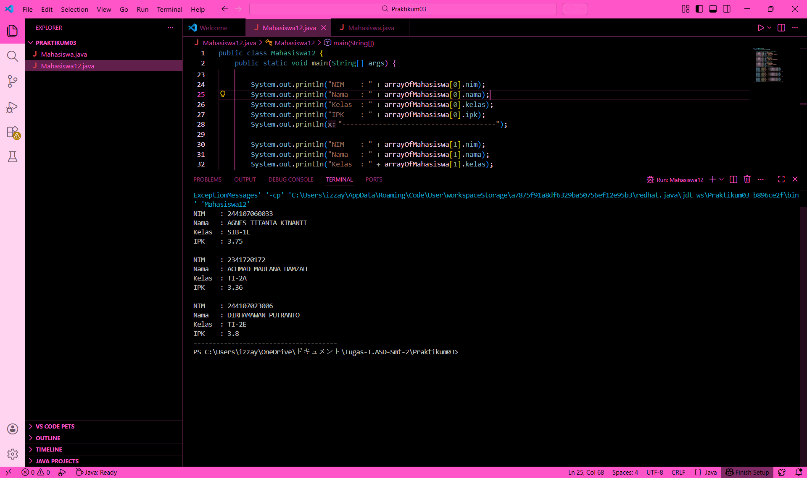
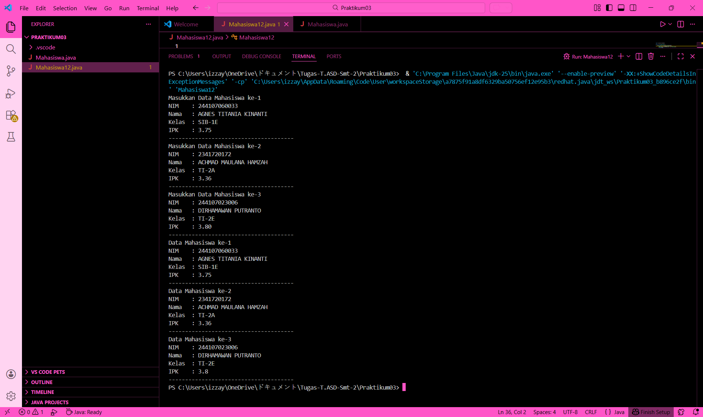
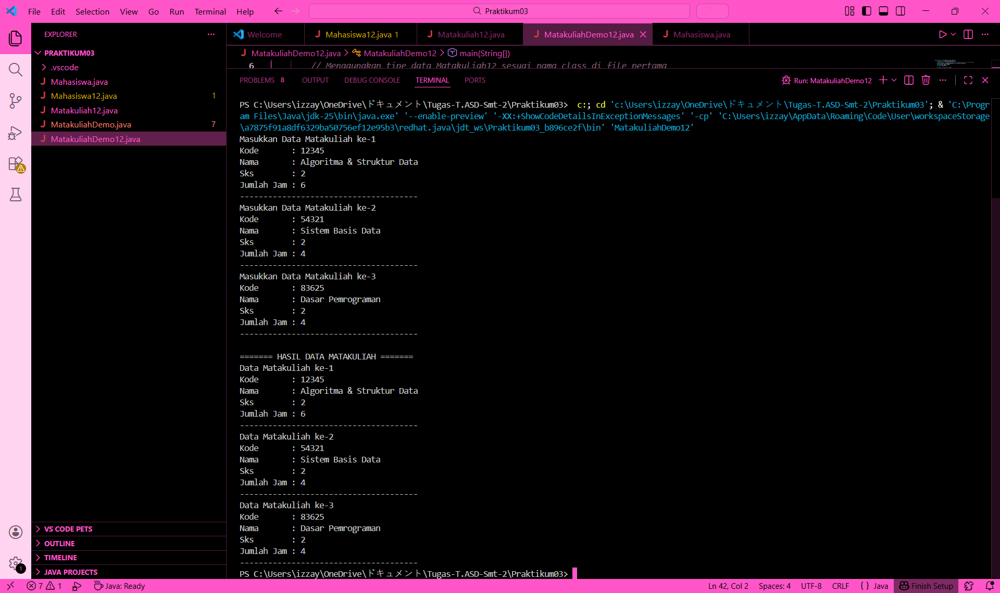

# Laporan Praktikum Algoritma dan Struktur Data - Jobsheet 3: Array of Objects

<h4>Nama : Izza Yaasmin Nabilla<h4>
<h4>NIM : 254107020226<h4>
<h4>Kelas : TI-1H<h4>

## 3.2 Percobaan 1: Membuat Array dari Object, Mengisi dan Menampilkan



### Jawaban Pertanyaan 3.2.3:
1. **Apakah array of objects dapat mendefinisikan class yang berbeda?**
   * Tidak bisa. Dalam satu array of objects, semua elemen harus memiliki tipe data atau class yang sama sesuai dengan deklarasi awal array tersebut.

2. **Apakah class yang akan dibuatkan array of objects harus memiliki atribut dan method?**
   * Class tersebut minimal harus memiliki atribut untuk menyimpan data. Method bersifat opsional, namun biasanya ditambahkan untuk memproses atau menampilkan data atribut tersebut.

3. **Apa keberadaan method `main()` pada class `Mahasiswa`?**
   * Method `main()` tidak berada di dalam class `Mahasiswa`. Method `main()` diletakkan pada class demo (seperti `MahasiswaDemo` atau `Mahasiswa12`) yang berfungsi sebagai titik awal eksekusi program untuk mengelola array of objects.

4. **Apa gunanya kode `arrayOfMahasiswa[0] = new Mahasiswa();`?**
   * Kode tersebut berfungsi untuk melakukan instansiasi atau menciptakan objek nyata dari class `Mahasiswa` pada indeks ke-0 dalam array. Tanpa perintah `new`, elemen array hanya akan bernilai `null`.

---

## 3.3 Percobaan 2: Menerima Input Data Array of Objects Menggunakan Scanner



### Jawaban Pertanyaan 3.3.3:
1. **Apakah kita bisa menggunakan perulangan lain selain `for` pada praktikum 3.3?**
   * Bisa. Kita dapat menggunakan perulangan `while` atau `do-while` selama kita mengelola variabel counter atau indeksnya secara manual untuk mengakses elemen array.

2. **Modifikasi kode pada praktikum 3.3 untuk memproses data 3 mahasiswa!**
   * Modifikasi dilakukan pada saat deklarasi array `new Mahasiswa[3]` dan mengubah batas kondisi perulangan menjadi `i < 3`.

3. **Apa kegunaan dari variabel `dummy` pada percobaan 3.3?**
   * Variabel `dummy` digunakan untuk menampung input sementara dalam bentuk String. Hal ini sering dilakukan saat menggunakan `sc.nextLine()` untuk menghindari masalah karakter *newline* yang tersisa di buffer saat membaca tipe data numerik.

4. **Mengapa pada baris program ke-24 dan ke-25 dilakukan instansiasi objek?**
   * Karena deklarasi array of objects hanya menyiapkan "wadah" atau tempat penyimpanan. Instansiasi di dalam perulangan diperlukan untuk mengisi setiap wadah (indeks) tersebut dengan objek yang sebenarnya agar data bisa disimpan.


## 3.4 Percobaan 3: Penambahan Operasi Matematika pada Elemen Array of Objects



### Jawaban Pertanyaan 3.4.3:
1. **Dapatkah kita melakukan operasi matematika terhadap atribut yang bertipe data numerik dalam array of objects?**
   * Ya, sangat bisa. Atribut objek yang bertipe numerik (seperti `int`, `float`, atau `double`) dapat dioperasikan menggunakan operator matematika biasa (seperti +, -, *, /) setelah kita mengakses atribut tersebut melalui referensi objek dan indeks array-nya.

2. **Bagaimana cara melakukan hitungan rata-rata IPK mahasiswa dari array of objects tersebut?**
   * Cara menghitungnya adalah dengan menjumlahkan seluruh nilai IPK di dalam perulangan, kemudian membaginya dengan jumlah total mahasiswa (panjang array).
     ```java
     double totalIPK = 0;
     for (int i = 0; i < arrayOfMahasiswa.length; i++) {
         totalIPK += arrayOfMahasiswa[i].ipk;
     }
     double rataRata = totalIPK / arrayOfMahasiswa.length;
     ```

3. **Apakah modifikasi kode pada praktikum 3.4 (seperti menghitung rata-rata) sebaiknya dilakukan di dalam class demo atau di dalam class objek itu sendiri?**
   * Idealnya, perhitungan yang bersifat kolektif (seperti rata-rata seluruh mahasiswa) dilakukan di class **Demo**. Namun, jika perhitungan bersifat individual (seperti menghitung sisa jam kuliah satu matakuliah), maka lebih baik diletakkan di dalam class objeknya sebagai sebuah **method**.

---

## 3.4 Percobaan 3: Penambahan Operasi Matematika pada Elemen Array of Objects


### Jawaban Pertanyaan 3.4.3:
1. **Dapatkah kita melakukan operasi matematika terhadap atribut yang bertipe data numerik dalam array of objects?**
   * Ya, sangat bisa. Atribut objek yang bertipe numerik (seperti `int`, `float`, atau `double`) dapat dioperasikan menggunakan operator matematika biasa (seperti +, -, *, /) setelah kita mengakses atribut tersebut melalui referensi objek dan indeks array-nya.

2. **Bagaimana cara melakukan hitungan rata-rata IPK mahasiswa dari array of objects tersebut?**
   * Cara menghitungnya adalah dengan menjumlahkan seluruh nilai IPK di dalam perulangan, kemudian membaginya dengan jumlah total mahasiswa (panjang array).
     ```java
     double totalIPK = 0;
     for (int i = 0; i < arrayOfMahasiswa.length; i++) {
         totalIPK += arrayOfMahasiswa[i].ipk;
     }
     double rataRata = totalIPK / arrayOfMahasiswa.length;
     ```

3. **Apakah modifikasi kode pada praktikum 3.4 (seperti menghitung rata-rata) sebaiknya dilakukan di dalam class demo atau di dalam class objek itu sendiri?**
   * Idealnya, perhitungan yang bersifat kolektif (seperti rata-rata seluruh mahasiswa) dilakukan di class **Demo**. Namun, jika perhitungan bersifat individual (seperti menghitung sisa jam kuliah satu matakuliah), maka lebih baik diletakkan di dalam class objeknya sebagai sebuah **method**.

---

